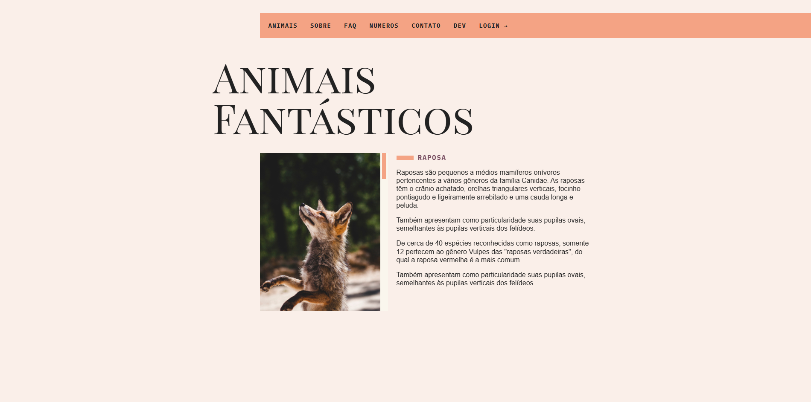

# Animais Fantásticos

Projeto de website que exibe e interage com dados de animais fantásticos. O intuito deste projeto é demonstrar técnicas de desenvolvimento web utilizando HTML, CSS e JavaScript, bem como a organização de arquivos e pastas para uma aplicação front-end.

## Captura de Tela



## Recursos

<li>Interface Interativa: Exibição de informações e imagens de animais fantásticos.</li>
<li>Estrutura Modular: Organização do código em pastas (JS, CSS, API e assets) para facilitar manutenção e escalabilidade.</li>
<li>API Local: Possibilidade de integrar ou simular uma API para obtenção de dados dinâmicos (pasta api).</li>
<li>Design Responsivo: Layout criado com HTML e CSS visando a melhor experiência em diferentes dispositivos.</li>

## Tecnologias Utilizadas

<li>HTML: Estrutura da página.</li>
<li>CSS: Estilização e design responsivo.</li>
<li>JavaScript: Interatividade e manipulação de dados.</li>
<li>API (local): Dados e endpoints para simulação de consulta de informações.</li>

## Instalação e Execução

<h3> Execute no terminal:</h3>

```sh
git clone https://github.com/AkiroSetonai/Animais-Fantasticos.git
```

<h3> Acesse o Diretório do Projeto: </h3>

```sh
cd Animais-Fantasticos

```

- Abra o Arquivo index.html
